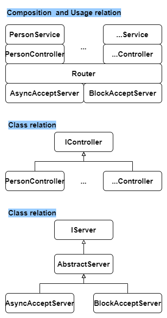

## About this project

The web api project are written in Node.js using Express.

## Version

There is a Version Zero on my github. The Version Zero remains the original code structure. Whileas, the Version One will try to translate the code from Javascript to Typescript, and i will going to add more features on this repo.

## Source code structure

### Tree view
The structure is organized similarly to your C++ project, and it also includes controllers, models, serializers, and services for handling a "person" resource.
```console
├── README.md
├── controllers
│   ├── abstractController.js
│   └── person
│       └── personController.js
├── doc
│   ├── webapi_project.drawio
│   └── webapi_project.png
├── models
│   └── person
│       └── person.js
├── package-lock.json
├── package.json
├── routes
│   ├── advance_person
│   │   └── advancePersonRoutes.js
│   ├── index.js
│   └── person
│       └── personRoutes.js
├── serializers
│   └── person
│       └── personSerializer.js
├── server.js
├── services
│   ├── advance_person
│   │   └── advancePersonService.js
│   ├── interfacePersonService.js
│   └── person
│       └── personService.js
└── tests
    ├── README.md
    ├── __pycache__
    │   ├── test_api_advance_person.cpython-312-pytest-8.3.5.pyc
    │   └── test_api_person.cpython-312-pytest-8.3.5.pyc
    ├── install_with_python3-xyz.sh
    ├── requirements.txt
    ├── test_api_advance_person.py
    └── test_api_person.py
```

### Composition Relationship


## Tips for git
```console
git status
git add .
git reset node-web-api/
git status
git commit -m "<message>"
git push
```

## How to buid and run

### Pre-installation
- Releation: package.json.
- Explanation:
    - name: The name of the project.
    - version: The version of the project.
    - description: A short description of the project.
    - main: The entry point file for the application (in this case, server.js).
    - scripts:
        - "start": The command to start the server, running node server.js.
        - "test": The command to run tests using Jest (jest).
    - dependencies:
        - express: A web framework used to handle HTTP requests.
        - body-parser: A middleware to parse incoming request bodies, especially for JSON payloads.
    - devDependencies:
        - jest: A testing framework used for running unit and integration tests.
        - supertest: A testing utility for making HTTP requests in tests.
        - engines: Specifies the minimum required version of Node.js to run the project.
```console
# to folder
mkdir node-web-api && cd node-web-api

# install
npm init -y
npm install
npm install express body-parser supertest

# install the TypeScript type definitions for Express.
npm install @types/express --save-dev
```

### Run program
```console
# Run server
node ../server.js
# or
npm start

# Run test (if have test writtern in .js)
npm test
```

## Tests

### Test via pytest
We have provide e2e tests via python scripts \
(please refer to the follwing README.md and navigate to tests folder) \
[tests/README.md](tests/README.md)

### Test via curl:
```console
# curl --help
# -X/--request [GET|POST|PUT|DELETE|PATCH]
# -H/--header
# -i/--include
# -d/--data 
# -v/--verbose
# -u/--user
# -b/--cookie

# POST
curl -X POST -H "Content-Type: application/json" -d '{"name": "John Doe", "age": 30}' http://localhost:1999/api/person -v

# GET
curl -X GET -H "Content-Type: application/json" http://localhost:1999/api/person -v

# PUT (not yet)

# PATCH (not yet)
curl -X PATCH -H "Content-Type: application/json" -d '{"name": "John Blue", "age": 18}' http://localhost:1999/api/person/0 -v

# GET
curl -X GET -H "Content-Type: application/json" http://localhost:1999/api/person/0 -v

# DELETE
curl -X DELETE -H "Content-Type: application/json" http://localhost:1999/api/person/0 -v
```
